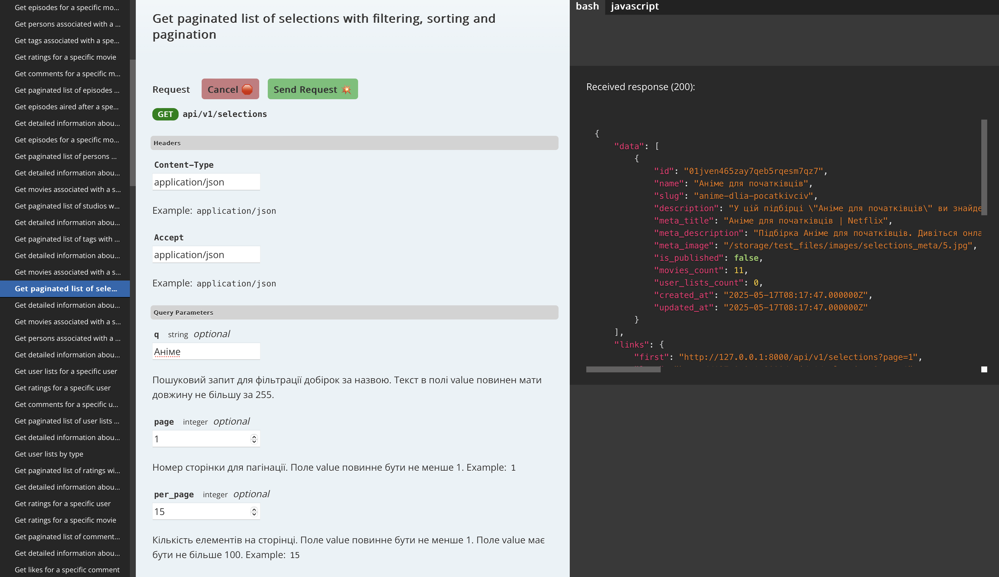
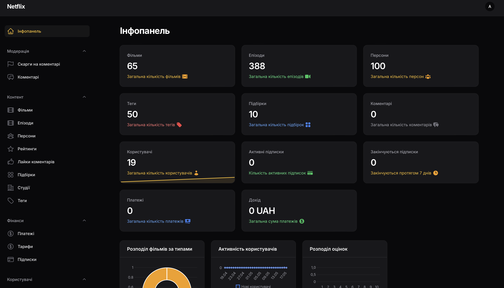
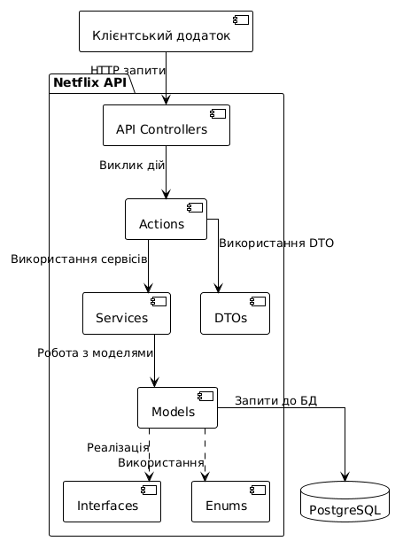
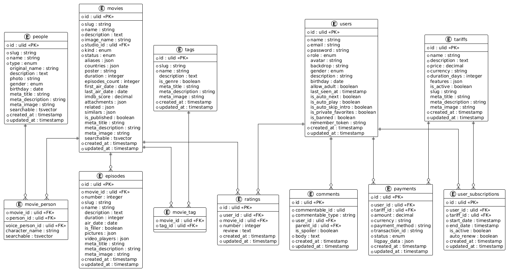

# KameraAction - Сервіс потокового відео

<p align="center">
  
</p>

<p align="center">
  <a href="https://laravel.com/docs/12.x"></a>
  <a href="https://php.net"></a>
  <a href="https://postgresql.org"></a>
  <a href="https://github.com/filamentphp/filament"></a>
</p>

## Зміст

- [Про проект](#про-проект)
- [Архітектура](#архітектура)
- [Функціональні можливості](#функціональні-можливості)
- [Встановлення](#встановлення)
- [API документація](#api-документація)
- [Тестування](#тестування)
- [Розробка](#розробка)

## Про проект

KameraAction - це бекенд частина сервісу потокового відео, розроблена на Laravel 12. Проект надає повний набір API для управління контентом, користувачами, підписками та платежами.

### Ключові метрики проєкту

- **15 бізнес-моделей** - повноцінна система сутностей для всіх аспектів стрімінгової платформи:
  - **5 one-to-one** зв'язків - для прямих відносин між сутностями
  - **8 one-to-many** зв'язків - для ієрархічних відносин
  - **7 many-to-many** зв'язків - для складних відносин між сутностями
- **29 контролерів** - для обробки всіх API запитів та взаємодії з клієнтами
- **159+ API маршрутів** - повне покриття всіх функціональних можливостей системи
- **76 Request класів** - для валідації вхідних даних та авторизації запитів
- **28 Resource класів** - для трансформації даних у відповіді API
- **69 Action класів** - інкапсуляція бізнес-логіки в окремі класи
- **61 DTO клас** - для безпечної передачі даних між шарами додатку
- **15 Policy класів** - для контролю доступу до ресурсів
- **13 Enum класів** - для типізації та структурування даних
- **15 Query Builder класів** - для розширення можливостей запитів до бази даних
- **4 Value Object класи** - для інкапсуляції складних значень
- **101 Filament компонент** - для адміністративної панелі
- **25 міграцій** - для структури бази даних
- **16 фабрик** - для генерації тестових даних
- **22 сідери** - для наповнення бази данимКи
- **135 тестів** - для забезпечення надійності та стабільності системи
- **1800+ асертів** - перевірок у тестах для гарантії правильної роботи системи

Система розроблена з урахуванням сучасних практик розробки програмного забезпечення та архітектурних патернів. Вона забезпечує високу продуктивність, масштабованість та безпеку. Проект використовує RESTful API для взаємодії з клієнтськими додатками та надає широкі можливості для інтеграції з іншими системами.

Основні переваги системи:
- **Висока продуктивність** - оптимізована робота з базою даних, кешування та ефективне використання ресурсів
- **Безпека** - захист від CSRF, XSS, SQL-ін'єкцій та інших типів атак
- **Масштабованість** - можливість горизонтального масштабування для обробки великої кількості запитів
- **Гнучкість** - модульна архітектура, яка дозволяє легко додавати нові функції
- **Документація** - автоматично генерована документація API для розробників
- **SEO-оптимізація** - вбудовані інструменти для покращення індексації контенту пошуковими системами
- **Повнотекстовий пошук** - швидкий та ефективний пошук по всьому контенту з використанням PostgreSQL tsvector
- **Людиночитаємі URL (slug)** - зрозумілі та SEO-дружні URL-адреси для всіх ресурсів
- **Робота з електронною поштою** - система сповіщень, підтвердження реєстрації та відновлення паролів

### Технологічний стек

- **Фреймворк**: Laravel 11.x
  - Використовується найновіша версія Laravel з підтримкою PHP 8.3+
  - Реалізовано патерн Repository для роботи з даними
  - Використання Actions для бізнес-логіки
  - Dependency Injection для зменшення зв'язності коду
  - Middleware для обробки запитів та авторизації

- **База даних**: PostgreSQL 14+
  - Повнотекстовий пошук з використанням tsvector
  - Використання JSON типів для гнучких структур даних
  - Оптимізовані індекси для швидкого пошуку
  - Міграції та сіди для управління структурою бази даних
  - Використання ULID замість звичайних ID для підвищення безпеки

- **Аутентифікація**: Laravel Sanctum
  - Токен-базована аутентифікація для API
  - Підтримка багатьох пристроїв одночасно
  - Налаштовані політики доступу (Policies)
  - Захист від CSRF атак
  - Підтримка OAuth для соціальних мереж

- **Адмін-панель**: Filament 3.x
  - Сучасний адміністративний інтерфейс
  - Розширені можливості для управління контентом
  - Інтерактивні графіки та статистика
  - Система сповіщень для адміністраторів
  - Налаштовані ролі та дозволи



- **Документація API**: Scribe
  - Автоматична генерація документації API
  - Інтерактивні приклади запитів
  - Підтримка Postman колекцій
  - Документація параметрів та відповідей
  - Підтримка OpenAPI специфікації



- **Платіжна система**: LiqPay
  - Безпечна обробка платежів
  - Підтримка різних методів оплати
  - Автоматичне продовження підписок
  - Система сповіщень про платежі
  - Детальна історія транзакцій

- **Тестування**: Pest PHP
  - Сучасний фреймворк для тестування
  - Покриття коду тестами
  - Функціональні та модульні тести
  - Тестування API ендпоінтів
  - Мок-об'єкти для ізоляції тестів

### Вимоги до системи

#### Серверні вимоги
- **PHP 8.2+**
  - Рекомендовано PHP 8.2 або вище для оптимальної продуктивності
  - Налаштований php.ini з достатнім обсягом пам'яті (min. 128MB)
  - Увімкнений OPcache для кращої продуктивності

- **Composer 2.0+**
  - Необхідний для встановлення залежностей
  - Рекомендовано останню версію для кращої сумісності

- **PostgreSQL 14+**
  - Необхідна підтримка JSON типів та повнотекстового пошуку
  - Рекомендовано виділити не менше 1GB пам'яті для бази даних
  - Налаштований pg_trgm модуль для нечіткого пошуку

- **Розширення PHP**
  - pdo_pgsql: для роботи з PostgreSQL
  - gd: для обробки зображень
  - intl: для інтернаціоналізації
  - opcache: для кешування байт-коду
  - fileinfo: для визначення MIME типів файлів
  - mbstring: для роботи з багатобайтовими рядками
  - xml: для обробки XML
  - zip: для роботи з архівами


## Архітектура

Проект побудований на основі сучасних архітектурних патернів та принципів, що забезпечує його гнучкість, масштабованість та легкість підтримки.

### Загальна архітектура

Система використовує багатошарову архітектуру з чітким розділенням відповідальності між компонентами:



#### Опис компонентів архітектури

1. **API Controllers** - контролери, які обробляють HTTP запити від клієнтів:
   - Валідація вхідних даних
   - Авторизація доступу
   - Делегування бізнес-логіки до Actions
   - Форматування відповідей

2. **Actions** - класи, що інкапсулюють бізнес-логіку:
   - Реалізація конкретних бізнес-операцій
   - Використання сервісів для складних операцій
   - Робота з DTO для передачі даних
   - Дотримання принципу єдиної відповідальності

3. **DTOs (Data Transfer Objects)** - об'єкти для передачі даних між шарами:
   - Валідація даних
   - Типізація даних
   - Іммутабельність для безпеки

4. **Services** - сервісні класи для складної бізнес-логіки:
   - Реалізація складних алгоритмів
   - Інтеграція з зовнішніми сервісами
   - Транзакційна логіка

5. **Models** - моделі даних Eloquent:
   - Визначення структури даних
   - Відносини між моделями
   - Мутатори та аксесори
   - Області запитів (Query Scopes)

6. **Interfaces** - інтерфейси для забезпечення гнучкості:
   - Контракти для реалізації
   - Можливість заміни реалізацій
   - Підтримка принципу інверсії залежностей

7. **Enums** - перелічення для типізації:
   - Типізовані константи
   - Методи для роботи з константами
   - Підвищення читабельності коду

#### Потік даних

1. Клієнт надсилає HTTP запит до API
2. Middleware обробляє запит (аутентифікація, CSRF захист тощо)
3. Контролер отримує запит та валідує дані
4. Контролер викликає відповідний Action
5. Action використовує Services та Models для виконання бізнес-логіки
6. Результат повертається назад через контролер до клієнта

#### Принципи проектування

- **SOLID** - дотримання принципів об'єктно-орієнтованого проектування
- **DRY (Don't Repeat Yourself)** - уникнення дублювання коду
- **KISS (Keep It Simple, Stupid)** - простота та зрозумілість коду
- **Separation of Concerns** - розділення відповідальності між компонентами
- **Dependency Injection** - впровадження залежностей для зменшення зв'язності

### Структура бази даних



#### Опис основних таблиць

1. **users** - користувачі системи:
   - Зберігає інформацію про користувачів (ім'я, email, пароль)
   - Містить налаштування користувача (автовідтворення, пропуск інтро)
   - Зберігає дані про останню активність
   - Підтримує різні ролі користувачів (адміністратор, звичайний користувач)

2. **movies** - фільми та серіали:
   - Основна інформація (назва, опис, постер)
   - Метадані (рейтинг IMDb, дати виходу)
   - SEO-інформація (мета-теги)
   - Повнотекстовий пошук через tsvector з підтримкою різних мов та словоформ
   - Slug-поля для людиночитаємих URL-адрес
   - Зв'язки з іншими таблицями (студії, теги, персони)

3. **episodes** - епізоди серіалів:
   - Прив'язка до конкретного серіалу
   - Інформація про епізод (назва, опис, тривалість)
   - Дані про відеоплеєри та зображення
   - Метадані для SEO

4. **people** - актори, режисери та інші учасники:
   - Основна інформація (ім'я, фото, біографія)
   - Тип персони (актор, режисер, продюсер тощо)
   - Метадані (дата народження, стать)
   - Повнотекстовий пошук

5. **tags** - теги та жанри:
   - Назва та опис
   - Прапорець для визначення жанрів
   - SEO-інформація

6. **ratings** - оцінки фільмів:
   - Зв'язок з користувачем та фільмом
   - Числова оцінка (від 1 до 10)
   - Текстовий відгук

7. **comments** - коментарі до контенту:
   - Поліморфний зв'язок з коментованим об'єктом
   - Підтримка вкладених коментарів
   - Прапорець для спойлерів

8. **tariffs** - тарифні плани:
   - Інформація про тариф (назва, опис, ціна)
   - Тривалість підписки в днях
   - Список функцій, доступних за тарифом

9. **user_subscriptions** - підписки користувачів:
   - Зв'язок з користувачем та тарифом
   - Дати початку та закінчення підписки
   - Прапорець для автоматичного продовження

10. **payments** - платежі:
    - Інформація про платіж (сума, валюта, метод)
    - Зв'язок з користувачем та тарифом
    - Статус платежу
    - Дані від платіжної системи

#### Особливості бази даних

- **ULID замість звичайних ID** - для підвищення безпеки та уникнення послідовних ідентифікаторів
- **Повнотекстовий пошук** - використання PostgreSQL tsvector для ефективного пошуку:
  - Індексація контенту для швидкого пошуку
  - Підтримка різних мов та словоформ
  - Ранжування результатів за релевантністю
  - Пошук з урахуванням синонімів та близьких термінів
- **Slug-генерація** - автоматичне створення людиночитаємих URL на основі назв:
  - Транслітерація кирилиці
  - Видалення спеціальних символів
  - Заміна пробілів на дефіси
  - Унікальність в межах категорії
- **JSON поля** - для зберігання гнучких структур даних
- **Поліморфні зв'язки** - для універсальних відносин (коментарі, списки)
- **Оптимізовані індекси** - для швидкого пошуку та сортування
- **Enum типи** - для типізованих полів (статуси, типи, ролі)

## Функціональні можливості

### Управління контентом

#### Фільми та серіали
- **Створення та редагування**: Повний CRUD для фільмів та серіалів
- **Детальна інформація**: Назва, опис, постер, рейтинг, дати виходу, тривалість
- **Метадані**: Країни виробництва, мови, рейтинг IMDb, посилання на зовнішні ресурси
- **Зв'язки**: Прив'язка до студій, тегів, жанрів та персон
- **Публікація**: Можливість керувати статусом публікації
- **SEO**: Налаштування мета-тегів для кращої індексації пошуковими системами
- **Slug**: Людиночитаємі URL-адреси для всіх фільмів та серіалів
- **Пошук**: Повнотекстовий пошук по назві, опису та іншим атрибутам з використанням PostgreSQL tsvector
- **Фільтрація**: За жанрами, роками, рейтингом, країнами та іншими параметрами

#### Епізоди
- **Управління епізодами**: Створення, редагування та видалення епізодів для серіалів
- **Нумерація**: Автоматична та ручна нумерація епізодів
- **Відеоплеєри**: Додавання різних джерел відео з різною якістю
- **Зображення**: Завантаження скріншотів та постерів
- **Метадані**: Дата виходу, тривалість, опис
- **Позначення філерів**: Можливість позначити епізод як філер (не пов'язаний з основним сюжетом)

#### Персони
- **Управління персонами**: Актори, режисери, сценаристи та інші
- **Профілі**: Детальна інформація, фото, біографія
- **Фільмографія**: Зв'язок з фільмами та серіалами
- **Ролі**: Вказання ролей та персонажів у фільмах
- **Озвучка**: Прив'язка акторів озвучки до персонажів

#### Студії
- **Управління студіями**: Компанії, які створюють контент
- **Профілі студій**: Логотип, опис, історія
- **Фільмографія**: Список фільмів та серіалів студії
- **Статистика**: Рейтинги та популярність контенту студії

#### Теги та жанри
- **Управління тегами**: Створення, редагування та видалення тегів
- **Жанри**: Спеціальні теги для категоризації за жанрами
- **Ієрархія**: Можливість створювати підкатегорії
- **Популярність**: Відстеження популярних тегів та жанрів

### Користувачі та авторизація

#### Реєстрація та авторизація
- **Реєстрація**: Створення облікового запису з підтвердженням email через систему сповіщень
- **Авторизація**: Вхід за допомогою email та пароля
- **Токен-автентифікація**: Використання Laravel Sanctum для API
- **Відновлення пароля**: Повний цикл відновлення забутого пароля через електронну пошту
- **Соціальні мережі**: Можливість входу через соціальні мережі (опціонально)
- **Захист від атак**: Обмеження кількості спроб входу, CSRF захист
- **Email-сповіщення**: Автоматичні сповіщення про важливі події (реєстрація, зміна пароля, нові релізи)

#### Профілі користувачів
- **Персональна інформація**: Ім'я, аватар, опис, дата народження
- **Налаштування перегляду**: Автовідтворення, автоперехід до наступного епізоду, пропуск інтро
- **Приватність**: Налаштування видимості списків та активності
- **Сповіщення**: Налаштування email-сповіщень про нові релізи, коментарі та інші події
- **Історія активності**: Відстеження останньої активності
- **Зміна пароля**: Можливість змінити пароль з поточного профілю з підтвердженням через email
- **Управління email**: Можливість змінити email з підтвердженням нової адреси

#### Ролі та права
- **Система ролей**: Адміністратори, модератори, звичайні користувачі
- **Права доступу**: Детальне налаштування прав для кожної ролі
- **Адміністративний доступ**: Спеціальні права для управління контентом
- **Модерація**: Можливість модерувати коментарі та скарги
- **Блокування**: Можливість блокувати порушників правил
- **Аудит дій**: Логування дій адміністраторів для безпеки

### Взаємодія з контентом

#### Коментарі
- **Система коментарів**: Можливість коментувати фільми, серіали та епізоди
- **Вкладені коментарі**: Підтримка відповідей на коментарі (деревовидна структура)
- **Форматування**: Базове форматування тексту (жирний, курсив, посилання)
- **Спойлери**: Можливість позначити коментар як спойлер з приховуванням вмісту
- **Лайки/дизлайки**: Оцінка коментарів іншими користувачами
- **Скарги**: Система скарг на неприйнятний вміст
- **Модерація**: Інструменти для модераторів (видалення, редагування, блокування)
- **Сповіщення**: Сповіщення про відповіді на коментарі

#### Оцінки та рейтинги
- **Система оцінок**: Можливість оцінювати фільми та серіали за 10-бальною шкалою
- **Відгуки**: Текстові відгуки до оцінок
- **Статистика**: Середній рейтинг, кількість оцінок, розподіл оцінок
- **Рекомендації**: Використання оцінок для формування рекомендацій
- **Популярність**: Рейтинг популярності контенту на основі оцінок та переглядів
- **Тренди**: Відстеження трендів та зростання популярності

#### Персональні списки
- **Типи списків**: Улюблене, переглянуто, заплановано, дивлюсь зараз, кинув дивитись
- **Управління списками**: Додавання та видалення контенту зі списків
- **Прогрес перегляду**: Відстеження прогресу перегляду серіалів
- **Приватність**: Налаштування видимості списків для інших користувачів
- **Сортування та фільтрація**: Можливість сортувати та фільтрувати вміст списків
- **Статистика**: Статистика переглядів та вподобань

#### Підбірки контенту
- **Тематичні колекції**: Створення тематичних підбірок фільмів та серіалів
- **Користувацькі підбірки**: Можливість для користувачів створювати власні підбірки
- **Редакційні підбірки**: Офіційні підбірки від адміністрації
- **Сезонні підбірки**: Спеціальні колекції до свят та подій
- **Популярні підбірки**: Відображення найпопулярніших підбірок
- **Рекомендовані підбірки**: Персоналізовані рекомендації підбірок

### Підписки та платежі

#### Тарифні плани
- **Різноманітні тарифи**: Базовий, стандартний, преміум з різними можливостями
- **Гнучкі періоди**: Місячні, квартальні, річні підписки
- **Функції за тарифами**: Різні набори функцій для кожного тарифу
- **Знижки**: Система знижок для довгострокових підписок
- **Пробний період**: Безкоштовний пробний період для нових користувачів
- **Порівняння тарифів**: Зручна таблиця порівняння можливостей тарифів

#### Платіжна система
- **Інтеграція з LiqPay**: Безпечна обробка платежів через LiqPay
- **Підтримка різних методів**: Банківські картки, електронні гаманці, мобільні платежі
- **Захист платежів**: Шифрування даних та захист від шахрайства
- **Автоматичні платежі**: Підтримка рекурентних платежів для автопродовження
- **Історія платежів**: Детальна історія всіх транзакцій
- **Чеки та квитанції**: Автоматична генерація чеків для користувачів та відправка їх на email

#### Управління підписками
- **Активація підписок**: Миттєва активація після успішної оплати
- **Деактивація**: Можливість скасувати підписку в будь-який момент
- **Автоматичне продовження**: Налаштування автоматичного продовження підписки
- **Зміна тарифу**: Можливість змінити тариф під час активної підписки
- **Сповіщення**: Нагадування про закінчення підписки через email
- **Відновлення**: Швидке відновлення раніше скасованої підписки
- **Email-комунікація**: Автоматичні листи про статус підписки, платежі та спеціальні пропозиції

#### Аналітика та звітність
- **Статистика продажів**: Детальна статистика продажів за періодами
- **Аналіз конверсії**: Відстеження конверсії від реєстрації до оплати
- **Популярність тарифів**: Аналіз популярності різних тарифних планів
- **Прогнозування доходу**: Інструменти для прогнозування майбутніх доходів
- **Експорт даних**: Можливість експорту даних для подальшого аналізу
- **Панель моніторингу**: Зручна панель для відстеження ключових показників

## Встановлення

### Клонування репозиторію

```bash
git clone https://github.com/yourusername/kameraaction-api.git
cd kameraaction-api
```

### Встановлення залежностей

```bash
composer install
npm install
```

### Налаштування середовища

1. Скопіюйте файл `.env.example` в `.env`:
   ```bash
   cp .env.example .env
   ```

2. Згенеруйте ключ додатку:
   ```bash
   php artisan key:generate
   ```

3. Налаштуйте підключення до бази даних у файлі `.env`:
   ```
   DB_CONNECTION=pgsql
   DB_HOST=127.0.0.1
   DB_PORT=5432
   DB_DATABASE=kameraaction
   DB_USERNAME=postgres
   DB_PASSWORD=your_password
   ```

4. Налаштуйте LiqPay (для платежів):
   ```
   LIQPAY_PUBLIC_KEY=your_public_key
   LIQPAY_PRIVATE_KEY=your_private_key
   ```

### Міграції та сіди

1. Запустіть міграції для створення структури бази даних:
   ```bash
   php artisan migrate
   ```

2. Заповніть базу даних тестовими даними:
   ```bash
   php artisan db:seed
   ```

### Запуск проекту

```bash
php artisan serve
```

Додаток буде доступний за адресою: http://localhost:8000

## API документація

API документація автоматично генерується за допомогою Scribe і доступна за адресою:

```
http://localhost:8000/docs
```

### Особливості документації

- **Інтерактивна документація**: Можливість тестувати API прямо з браузера
- **Автоматична генерація**: Документація оновлюється автоматично при зміні API
- **Приклади запитів**: Готові приклади запитів для різних мов програмування
- **Опис параметрів**: Детальний опис всіх параметрів запитів та відповідей
- **Автентифікація**: Інформація про методи автентифікації
- **Postman колекція**: Можливість завантажити готову Postman колекцію
- **OpenAPI специфікація**: Відповідність стандарту OpenAPI 3.0

### Повний список API маршрутів

#### Публічні маршрути

##### Автентифікація
- `POST /api/v1/register` - Реєстрація нового користувача
- `POST /api/v1/login` - Авторизація користувача
- `POST /api/v1/forgot-password` - Запит на відновлення пароля
- `POST /api/v1/reset-password` - Скидання пароля

##### Пошук
- `GET /api/v1/search` - Пошук контенту
- `GET /api/v1/search/autocomplete` - Автодоповнення для пошуку

##### Популярний контент
- `GET /api/v1/popular/movies` - Популярні фільми
- `GET /api/v1/popular/series` - Популярні серіали
- `GET /api/v1/popular/people` - Популярні персони
- `GET /api/v1/popular/tags` - Популярні теги
- `GET /api/v1/popular/selections` - Популярні підбірки

##### Фільми та серіали
- `GET /api/v1/movies` - Отримання списку фільмів з фільтрацією та пагінацією
- `GET /api/v1/movies/{movie}` - Отримання детальної інформації про фільм
- `GET /api/v1/movies/{movie}/episodes` - Отримання епізодів для серіалу
- `GET /api/v1/movies/{movie}/persons` - Отримання акторів та творців фільму
- `GET /api/v1/movies/{movie}/tags` - Отримання тегів та жанрів фільму
- `GET /api/v1/movies/{movie}/ratings` - Отримання оцінок фільму
- `GET /api/v1/movies/{movie}/comments` - Отримання коментарів до фільму

##### Епізоди
- `GET /api/v1/episodes` - Отримання списку епізодів
- `GET /api/v1/episodes/aired-after/{date}` - Отримання епізодів, випущених після вказаної дати
- `GET /api/v1/episodes/{episode}` - Отримання інформації про епізод
- `GET /api/v1/episodes/movie/{movie}` - Отримання всіх епізодів серіалу

##### Персони
- `GET /api/v1/people` - Отримання списку персон
- `GET /api/v1/people/{person}` - Отримання інформації про персону
- `GET /api/v1/people/{person}/movies` - Отримання фільмографії персони

##### Студії
- `GET /api/v1/studios` - Отримання списку студій
- `GET /api/v1/studios/{studio}` - Отримання інформації про студію

##### Теги
- `GET /api/v1/tags` - Отримання списку тегів
- `GET /api/v1/tags/{tag}` - Отримання інформації про тег
- `GET /api/v1/tags/{tag}/movies` - Отримання фільмів за тегом

##### Підбірки
- `GET /api/v1/selections` - Отримання списку підбірок
- `GET /api/v1/selections/{selection}` - Отримання інформації про підбірку
- `GET /api/v1/selections/{selection}/movies` - Отримання фільмів з підбірки
- `GET /api/v1/selections/{selection}/persons` - Отримання персон з підбірки

##### Користувачі (публічна інформація)
- `GET /api/v1/users/{user}` - Отримання публічної інформації про користувача
- `GET /api/v1/users/{user}/user-lists` - Отримання списків користувача
- `GET /api/v1/users/{user}/ratings` - Отримання оцінок користувача
- `GET /api/v1/users/{user}/comments` - Отримання коментарів користувача

##### Списки користувачів
- `GET /api/v1/user-lists` - Отримання списків користувачів
- `GET /api/v1/user-lists/{userList}` - Отримання інформації про список
- `GET /api/v1/user-lists/type/{type}` - Отримання списків за типом
- `GET /api/v1/users/{user}/user-lists` - Отримання списків конкретного користувача

##### Оцінки
- `GET /api/v1/ratings` - Отримання всіх оцінок
- `GET /api/v1/ratings/{rating}` - Отримання інформації про оцінку
- `GET /api/v1/ratings/user/{user}` - Отримання оцінок користувача
- `GET /api/v1/ratings/movie/{movie}` - Отримання оцінок фільму

##### Лайки коментарів
- `GET /api/v1/comment-likes` - Отримання всіх лайків коментарів
- `GET /api/v1/comment-likes/{commentLike}` - Отримання інформації про лайк
- `GET /api/v1/comment-likes/comment/{comment}` - Отримання лайків для коментаря

##### Тарифи
- `GET /api/v1/tariffs` - Отримання списку тарифів
- `GET /api/v1/tariffs/{tariff}` - Отримання інформації про тариф

##### Коментарі
- `GET /api/v1/comments/recent` - Отримання останніх коментарів
- `GET /api/v1/comments/roots/{commentable_type}/{commentable_id}` - Отримання кореневих коментарів
- `GET /api/v1/comments` - Отримання всіх коментарів
- `GET /api/v1/comments/{comment}` - Отримання інформації про коментар
- `GET /api/v1/comments/{comment}/replies` - Отримання відповідей на коментар

##### Переліки (Enums)
- `GET /api/v1/enums/kinds` - Отримання типів контенту
- `GET /api/v1/enums/kinds/{kind}` - Отримання інформації про тип контенту
- `GET /api/v1/enums/statuses` - Отримання статусів
- `GET /api/v1/enums/statuses/{status}` - Отримання інформації про статус
- `GET /api/v1/enums/person-types` - Отримання типів персон
- `GET /api/v1/enums/person-types/{type}` - Отримання інформації про тип персони
- `GET /api/v1/enums/user-list-types` - Отримання типів списків користувачів
- `GET /api/v1/enums/user-list-types/{type}` - Отримання інформації про тип списку
- `GET /api/v1/enums/video-qualities` - Отримання якостей відео
- `GET /api/v1/enums/video-qualities/{quality}` - Отримання інформації про якість відео
- `GET /api/v1/enums/genders` - Отримання статей
- `GET /api/v1/enums/genders/{gender}` - Отримання інформації про стать
- `GET /api/v1/enums/comment-report-types` - Отримання типів скарг на коментарі
- `GET /api/v1/enums/comment-report-types/{type}` - Отримання інформації про тип скарги
- `GET /api/v1/enums/movie-relate-types` - Отримання типів зв'язків між фільмами
- `GET /api/v1/enums/movie-relate-types/{type}` - Отримання інформації про тип зв'язку
- `GET /api/v1/enums/payment-statuses` - Отримання статусів платежів
- `GET /api/v1/enums/payment-statuses/{status}` - Отримання інформації про статус платежу
- `GET /api/v1/enums/api-source-names` - Отримання назв API джерел
- `GET /api/v1/enums/api-source-names/{source}` - Отримання інформації про API джерело
- `GET /api/v1/enums/attachment-types` - Отримання типів вкладень
- `GET /api/v1/enums/attachment-types/{type}` - Отримання інформації про тип вкладення

##### Платежі
- `POST /api/v1/liqpay/callback` - Callback для LiqPay

#### Захищені маршрути (потребують автентифікації)

##### Верифікація користувача
- `GET /api/v1/verify-email/{id}/{hash}` - Верифікація email
- `POST /api/v1/email/verification-notification` - Надсилання повідомлення для верифікації
- `POST /api/v1/logout` - Вихід з системи

##### Профіль користувача
- `GET /api/v1/user` - Отримання інформації про поточного користувача

##### Рекомендації
- `GET /api/v1/recommendations` - Отримання всіх рекомендацій
- `GET /api/v1/recommendations/movies` - Отримання рекомендованих фільмів
- `GET /api/v1/recommendations/series` - Отримання рекомендованих серіалів
- `GET /api/v1/recommendations/similar/{movie}` - Отримання схожих фільмів
- `GET /api/v1/recommendations/because-you-watched/{movie}` - Рекомендації на основі переглянутого
- `GET /api/v1/recommendations/continue-watching` - Продовження перегляду

##### Користувачі
- `PUT /api/v1/users/{user}` - Оновлення профілю користувача
- `PATCH /api/v1/users/{user}` - Часткове оновлення профілю
- `GET /api/v1/users/{user}/subscriptions` - Отримання підписок користувача

##### Списки користувачів
- `POST /api/v1/user-lists` - Створення списку
- `DELETE /api/v1/user-lists/{userList}` - Видалення списку

##### Оцінки
- `POST /api/v1/ratings` - Додавання оцінки
- `PUT /api/v1/ratings/{rating}` - Оновлення оцінки
- `DELETE /api/v1/ratings/{rating}` - Видалення оцінки

##### Коментарі
- `POST /api/v1/comments` - Додавання коментаря
- `PUT /api/v1/comments/{comment}` - Оновлення коментаря
- `DELETE /api/v1/comments/{comment}` - Видалення коментаря
- `GET /api/v1/comments/user/{user}` - Отримання коментарів користувача

##### Лайки коментарів
- `POST /api/v1/comment-likes` - Додавання лайку
- `GET /api/v1/comment-likes/user/{user}` - Отримання лайків користувача
- `PUT /api/v1/comment-likes/{commentLike}` - Оновлення лайку
- `DELETE /api/v1/comment-likes/{commentLike}` - Видалення лайку

##### Скарги на коментарі
- `POST /api/v1/comment-reports` - Додавання скарги
- `GET /api/v1/comment-reports/comment/{comment}` - Отримання скарг на коментар

##### Підписки та платежі
- `GET /api/v1/user-subscriptions` - Отримання всіх підписок
- `POST /api/v1/user-subscriptions` - Створення підписки
- `GET /api/v1/user-subscriptions/active` - Отримання активних підписок
- `GET /api/v1/user-subscriptions/user/{user}` - Отримання підписок користувача
- `GET /api/v1/user-subscriptions/{userSubscription}` - Отримання інформації про підписку
- `GET /api/v1/payments` - Отримання всіх платежів
- `POST /api/v1/payments` - Створення платежу
- `GET /api/v1/payments/{payment}` - Отримання інформації про платіж
- `GET /api/v1/payments/user/{user}` - Отримання платежів користувача
- `POST /api/v1/liqpay/create-payment` - Створення платежу через LiqPay
- `GET /api/v1/subscriptions/result` - Отримання результату підписки

#### Адміністративні маршрути

##### Управління користувачами
- `GET /api/v1/admin/users` - Отримання всіх користувачів
- `POST /api/v1/admin/users` - Створення користувача
- `DELETE /api/v1/admin/users/{user}` - Видалення користувача
- `PATCH /api/v1/admin/users/{user}/ban` - Блокування користувача
- `PATCH /api/v1/admin/users/{id}/unban` - Розблокування користувача

##### Управління контентом
- `POST /api/v1/admin/movies` - Створення фільму
- `PUT /api/v1/admin/movies/{movie}` - Оновлення фільму
- `PATCH /api/v1/admin/movies/{movie}` - Часткове оновлення фільму
- `DELETE /api/v1/admin/movies/{movie}` - Видалення фільму
- `POST /api/v1/admin/episodes` - Створення епізоду
- `PUT /api/v1/admin/episodes/{episode}` - Оновлення епізоду
- `DELETE /api/v1/admin/episodes/{episode}` - Видалення епізоду
- `POST /api/v1/admin/people` - Створення персони
- `PUT /api/v1/admin/people/{person}` - Оновлення персони
- `DELETE /api/v1/admin/people/{person}` - Видалення персони
- `POST /api/v1/admin/studios` - Створення студії
- `PUT /api/v1/admin/studios/{studio}` - Оновлення студії
- `DELETE /api/v1/admin/studios/{studio}` - Видалення студії
- `POST /api/v1/admin/tags` - Створення тегу
- `PUT /api/v1/admin/tags/{tag}` - Оновлення тегу
- `DELETE /api/v1/admin/tags/{tag}` - Видалення тегу
- `POST /api/v1/admin/selections` - Створення підбірки
- `PUT /api/v1/admin/selections/{selection}` - Оновлення підбірки
- `DELETE /api/v1/admin/selections/{selection}` - Видалення підбірки

##### Модерація
- `GET /api/v1/admin/comment-reports` - Отримання всіх скарг
- `GET /api/v1/admin/comment-reports/unviewed` - Отримання непереглянутих скарг
- `GET /api/v1/admin/comment-reports/{commentReport}` - Отримання інформації про скаргу
- `PUT /api/v1/admin/comment-reports/{commentReport}` - Оновлення скарги
- `DELETE /api/v1/admin/comment-reports/{commentReport}` - Видалення скарги

##### Управління підписками
- `POST /api/v1/admin/tariffs` - Створення тарифу
- `PUT /api/v1/admin/tariffs/{tariff}` - Оновлення тарифу
- `DELETE /api/v1/admin/tariffs/{tariff}` - Видалення тарифу

##### Статистика та звіти
- `GET /api/v1/admin/stats/users` - Статистика користувачів
- `GET /api/v1/admin/stats/content` - Статистика контенту
- `GET /api/v1/admin/stats/subscriptions` - Статистика підписок
- `GET /api/v1/admin/stats/payments` - Статистика платежів

## Тестування

Проект використовує Pest PHP для тестування. Система тестування забезпечує високу якість коду та стабільність роботи API.

### Типи тестів

#### Модульні тести (Unit Tests)
- Тестування окремих компонентів системи ізольовано
- Перевірка бізнес-логіки в Actions та Services
- Тестування моделей та їх відносин
- Перевірка валідації в DTO

#### Функціональні тести (Feature Tests)
- Тестування API ендпоінтів
- Перевірка повного циклу запит-відповідь
- Тестування авторизації та прав доступу
- Перевірка валідації вхідних даних

#### Інтеграційні тести (Integration Tests)
- Тестування взаємодії між компонентами
- Перевірка роботи з базою даних
- Тестування кешування
- Перевірка інтеграції з зовнішніми сервісами (LiqPay)

### Запуск тестів

#### Запуск всіх тестів
```bash
php artisan test
```

#### Запуск конкретної групи тестів
```bash
php artisan test --group=api
```

#### Запуск тестів з певного файлу
```bash
php artisan test tests/Feature/MovieTest.php
```

#### Запуск тестів з покриттям коду
```bash
php artisan test --coverage
```

### Структура тестів

- `tests/Unit/` - Модульні тести
  - `tests/Unit/Models/` - Тести моделей
  - `tests/Unit/Actions/` - Тести класів дій
  - `tests/Unit/Services/` - Тести сервісів

- `tests/Feature/` - Функціональні тести
  - `tests/Feature/Api/` - Тести API ендпоінтів
  - `tests/Feature/Auth/` - Тести автентифікації
  - `tests/Feature/Admin/` - Тести адміністративних функцій

### Мокування та фабрики

- **Фабрики моделей**: Для створення тестових даних
- **Мок-об'єкти**: Для ізоляції тестованого коду
- **Фейкові сервіси**: Для тестування без зовнішніх залежностей
- **Сіди для тестів**: Спеціальні сіди для наповнення тестової бази даних

## Розробка

### Структура проекту

#### Основні директорії
- `app/` - Основний код додатку
  - `Actions/` - Класи дій (за патерном Action)
    - `Movies/` - Дії для роботи з фільмами
    - `Users/` - Дії для роботи з користувачами
    - `Payments/` - Дії для роботи з платежами
  - `DTOs/` - Data Transfer Objects
    - `Movies/` - DTO для фільмів
    - `Users/` - DTO для користувачів
    - `Payments/` - DTO для платежів
  - `Enums/` - Перелічення
    - `Kind.php` - Типи контенту (фільм, серіал)
    - `Status.php` - Статуси контенту
    - `Role.php` - Ролі користувачів
  - `Http/Controllers/` - Контролери API
    - `Auth/` - Контролери автентифікації
    - `Admin/` - Адміністративні контролери
  - `Models/` - Моделі Eloquent
    - `Builders/` - Кастомні білдери запитів
    - `Scopes/` - Області запитів
    - `Traits/` - Трейти для моделей
  - `Services/` - Сервісні класи
    - `Payment/` - Сервіси для роботи з платежами
    - `Search/` - Сервіси для пошуку
  - `Interfaces/` - Інтерфейси
  - `Rules/` - Правила валідації
  - `Exceptions/` - Кастомні винятки
  - `Filament/` - Компоненти адмін-панелі
- `config/` - Конфігураційні файли
- `database/` - Міграції та сіди
  - `migrations/` - Міграції бази даних
  - `seeders/` - Сіди для наповнення бази
  - `factories/` - Фабрики для тестування
- `routes/` - Маршрути додатку
  - `api.php` - API маршрути
  - `web.php` - Веб-маршрути
- `tests/` - Тести
  - `Feature/` - Функціональні тести
  - `Unit/` - Модульні тести
- `resources/` - Ресурси
  - `views/` - Шаблони Blade
  - `js/` - JavaScript файли
  - `css/` - CSS файли
- `public/` - Публічні файли
  - `docs/` - Згенерована документація API

#### Ключові файли
- `composer.json` - Залежності PHP
- `package.json` - Залежності JavaScript
- `phpunit.xml` - Конфігурація тестування
- `.env.example` - Приклад конфігурації середовища
- `artisan` - Консольний інтерфейс Laravel

### Стандарти кодування

Проект дотримується стандартів кодування PSR-12 та інших кращих практик розробки.

#### Інструменти для перевірки коду
- **Laravel Pint** - Форматування коду за стандартами
  ```bash
  composer pint
  ```

- **PHP Stan** - Статичний аналіз коду
  ```bash
  composer analyse
  ```

- **PHP CS Fixer** - Виправлення стилю коду
  ```bash
  composer fix
  ```

#### Принципи розробки
- **Чистий код** - Зрозумілі імена, короткі методи, чітка відповідальність
- **SOLID** - Дотримання принципів об'єктно-орієнтованого проектування
- **DRY** - Уникнення дублювання коду
- **Документування** - Коментарі PHPDoc для класів та методів
- **Типізація** - Використання строгої типізації PHP 8.2+

### Робочий процес розробки

#### Процес внесення змін
1. Створення гілки з `develop`
2. Розробка функціоналу
3. Написання тестів
4. Перевірка коду (Pint, PHPStan)
5. Створення Pull Request
6. Код-ревю

#### Середовище розробки
- **IDE**: PHPStorm або VSCode з PHP плагінами
- **Локальний сервер**: Laravel Sail (Docker) або Valet
- **Бази даних**: PostgreSQL
- **Кешування**: Redis (опціонально)

### Корисні команди

#### Робота з базою даних
```bash
# Запуск міграцій
php artisan migrate

# Відкат міграцій
php artisan migrate:rollback

# Скидання та повторне застосування міграцій
php artisan migrate:fresh

# Наповнення бази тестовими даними
php artisan db:seed
```

#### Генерація коду
```bash
# Створення міграції
php artisan make:migration create_table_name

# Створення моделі з міграцією та фабрикою
php artisan make:model ModelName -mf

# Створення контролера
php artisan make:controller ControllerName

# Створення Action класу
php artisan make:action ActionName
```

#### Робота з документацією
```bash
# Генерація API документації
php artisan scribe:generate
```

#### Кешування
```bash
# Очищення кешу
php artisan cache:clear

# Очищення кешу маршрутів
php artisan route:clear

# Очищення кешу конфігурації
php artisan config:clear
```
